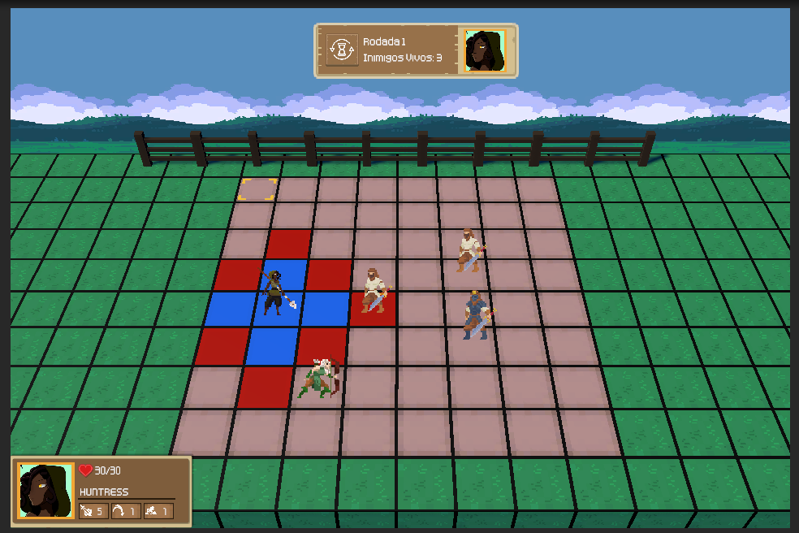

# Monografia

<b>O Uso de Inteligência Artificial na construção de jogos digitais com personagens não-jogáveis engajados (2021)</b>

- <b>Autor:</b> Guilherme Alves da Silva
- <b>Orientador:</b> Marcos Wagner de Souza
- Instituto de Ciências Exatas e Tecnológicas (ICET) - Universidade Federal de Jataí (UFJ). Bacharelado em Ciências da Computação.

## Introdução
- <b>Tema:</b> Inteligência Artificial, jogos digitais.
- <b>Objeto de estudo:</b> Personagens não-jogáveis (NPCs).
- <b>Problema:</b> Superficialidade no comportamento de NPCs em jogos digitais.

## Resumo

NPCs (<i>Non-Player Character</i>) ou personagens não jogáveis nem sempre possuem comportamentos considerados adequados e responsivos. E, esta artificialidade pode gerar problemas de qualidade em um jogo e até reduzir o interesse do jogador. Com base nesta afirmação, este trabalho apresenta uma Revisão Sistemática de Literatura (RSL) sobre o desenvolvimento de NPCs com comportamentos engajados. A revisão possibilitou o mapeamento e o conhecimento do estado atual dos estudos correlatos, extraindo 18 artigos relacionados ao estado da arte. A partir da análise, verificou-se que determinadas técnicas tradicionalmente usadas pela indústria de jogos digitais têm se tornado um grande obstáculo na geração de comportamento de NPCs mais engajados ao ambiente virtual.

## Objetivo
- Desenvolvimento do processo de tomada de decisão para NPCs para um jogo digital, utilizando técnicas de IA.
- <b>Tecnologias de apoio:</b> Unity (C#). 

## Link para Download

<h1 align="center">
  
</h1>

- https://zsb-gui.itch.io/witnessess 
